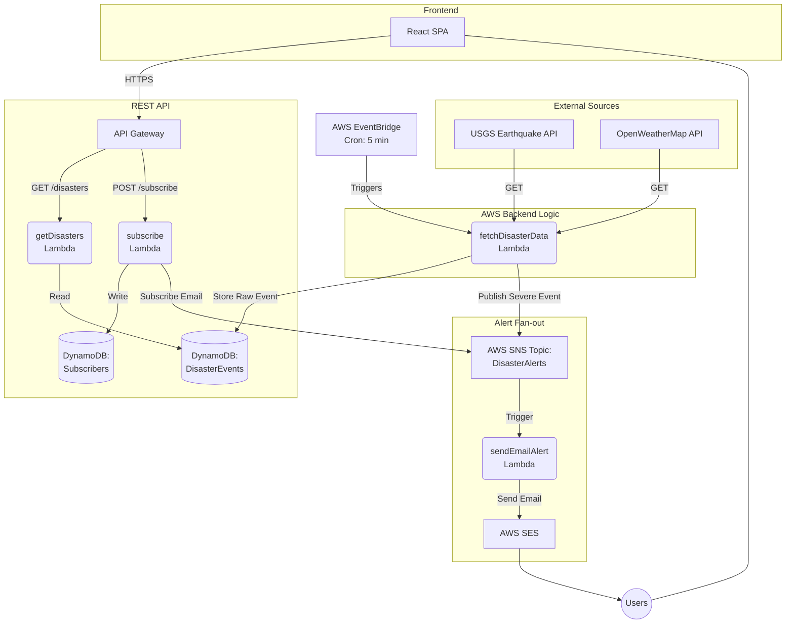

# Real-Time Disaster Alert System

**Event-Driven | Serverless | Cloud-Native**

A complete full-stack project built on AWS demonstrating real-world cloud architecture and real-time disaster monitoring.

**Live Demo:** [http://disaster-management-trisharan-001.s3-website.ap-south-1.amazonaws.com/](http://disaster-management-trisharan-001.s3-website.ap-south-1.amazonaws.com/)


---

## Project Structure

```text
disaster-alert-system/
├── template.yaml                          # AWS SAM Infrastructure as Code
├── functions/                             # Backend AWS Lambda functions
│   ├── fetchDisasterData/                 # Cron: fetches USGS and weather data
│   ├── getDisasters/                      # GET /disasters API endpoint
│   ├── subscribe/                         # POST /subscribe API endpoint
│   └── sendEmailAlert/                    # Email alerts via SES (SNS-triggered)
├── frontend/                              # Frontend React dashboard (Vite)
│   ├── src/
│   │   ├── App.jsx                        # Main React application
│   │   └── main.jsx                       # Application entry point
│   ├── package.json
│   └── vite.config.js
└── docs/                                  # Documentation
    ├── ARCHITECTURE.md                    # System design explanation
    └── DEPLOYMENT.md                      # Deployment instructions
```

---

## Local Development (Frontend)

To run the frontend locally without deploying the backend infrastructure:

```bash
cd frontend
npm install
npm run dev
```

The dashboard will load and fetch live earthquake data directly from the USGS public APIs.

---

## Full AWS Deployment

To deploy the entire backend infrastructure to AWS:

```bash
sam build
sam deploy --guided
```

Please refer to `docs/DEPLOYMENT.md` for a comprehensive deployment guide, including prerequisites and configuration steps.

---

## System Architecture



---

## Data Sources

| Source | Data Type | Endpoint | Authentication |
| :--- | :--- | :--- | :--- |
| USGS | Earthquakes (Magnitude 4.5+) | `earthquake.usgs.gov/earthquakes/feed/v1.0/summary/` | None required |
| OpenWeatherMap | Severe Storms and Weather Alerts | `api.openweathermap.org/data/3.0/onecall` | API Key |

---

## Severity Classification Logic

### Earthquake Magnitude
* **Critical**: Magnitude >= 7.0 (Major - devastating damage)
* **High**: Magnitude >= 6.0 (Strong - significant damage)
* **Medium**: Magnitude >= 5.0 (Moderate - felt widely)
* **Low**: Magnitude < 5.0 (Minor - slight impact)

### Wind Speed
* **Critical**: Speed >= 180 km/h (Category 5 hurricane)
* **High**: Speed >= 120 km/h (Category 3+)
* **Medium**: Speed >= 80 km/h (Severe)

---

## Technology Stack

* **Frontend**: React, Vite
* **Backend Runtime**: Node.js 18
* **Compute**: AWS Lambda
* **Database**: AWS DynamoDB (NoSQL)
* **Messaging**: AWS SNS (Simple Notification Service)
* **Email Service**: AWS SES (Simple Email Service)
* **API Routing**: AWS API Gateway (REST)
* **Task Scheduling**: AWS EventBridge
* **Infrastructure as Code**: AWS SAM (Serverless Application Model)
* **CI/CD Pipeline**: GitHub Actions for automated AWS and S3 deployment
