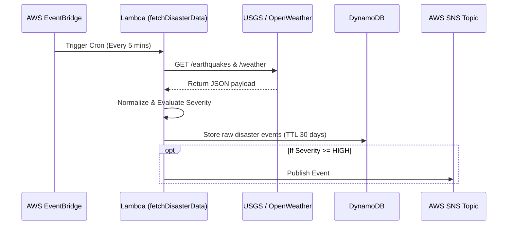
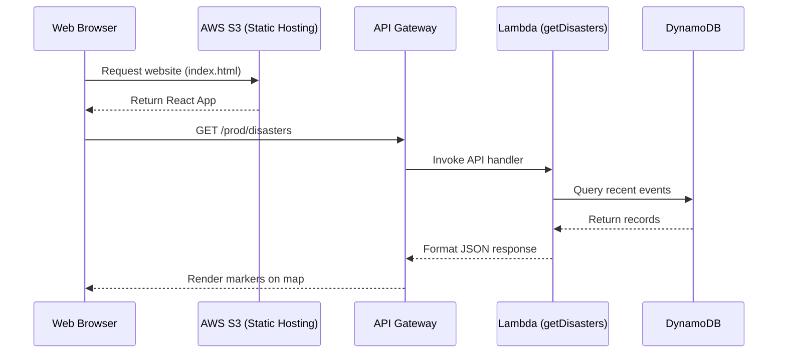
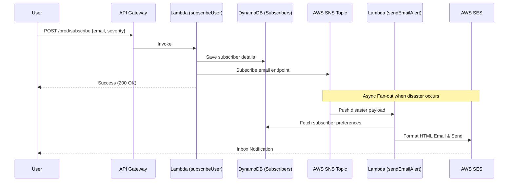

# Project Report: Real-Time Disaster Alert System
**Perspective:** Cloud Computing & Serverless Architecture

---

## 1. Executive Summary

The **Real-Time Disaster Alert System** is a full-stack, cloud-native application designed to continuously monitor global disaster events (such as earthquakes and severe weather) and provide immediate notifications to affected users. By leveraging a completely serverless, event-driven architecture on Amazon Web Services (AWS), the system eliminates the need for traditional server provisioning. It achieves massive scalability, high availability, and a pay-per-use cost model, perfectly demonstrating the core advantages of modern cloud computing.

---

## 2. Problem Statement & Cloud Justification

### The Problem
Traditional disaster monitoring systems require constant polling of external data sources. In a traditional on-premises or VM-based setup, this requires servers running 24/7, consuming resources even when no disasters are occurring. Furthermore, during a major disaster, web traffic and notification queues spike unpredictably, often causing legacy systems to crash under load.

### The Cloud Computing Solution
To solve this, the project adopts a **Serverless Cloud Architecture**:
* **Elasticity**: Services automatically scale up during traffic spikes (e.g., thousands of users viewing the dashboard during an earthquake) and scale down to zero during quiet periods.
* **Cost-Efficiency**: Leveraging AWS Lambda means costs are incurred solely for the exact compute time used to process an event, avoiding idle server costs.
* **Decoupling**: Using managed message brokers (SNS) ensures that the data ingestion process is completely independent of the notification process.

---

## 3. Cloud Architecture Overview

The system is built entirely on managed AWS services, defined using **Infrastructure as Code (IaC)** via the AWS Serverless Application Model (SAM).

### Key Architectural Patterns Used
1. **Event-Driven Architecture (EDA)**: The system reacts to state changes. A scheduled event triggers data fetching; a severe disaster detection triggers an SNS publish event, which in turn triggers email/SMS Lambdas.
2. **Fan-Out Pattern**: A single disaster event is published to an AWS SNS topic. Multiple independent subscribers (Email Lambda, SMS Lambda) consume this single event in parallel.
3. **Stateless Compute**: AWS Lambda functions retain no local state, relying on Amazon DynamoDB for persistent data storage, allowing infinite horizontal scaling.

---

## 4. User Flows & System Interactions

### Flow 1: Automated Data Ingestion (System Flow)
This flow happens entirely in the backend without user intervention.

### Flow 2: End-User Dashboard Access (Read Flow)
How a user interacts with the React frontend to view live data.

### Flow 3: Subscription & Alerting (Write & Push Flow)
How a user subscribes and receives automated alerts.

---

## 5. Core Cloud Services Utilized

| Service | Cloud Paradigm | Implementation in Project |
| :--- | :--- | :--- |
| **AWS Lambda** | Function as a Service (FaaS) | Executes all backend business logic without managing runtimes. |
| **Amazon DynamoDB** | Managed NoSQL DBaaS | Stores disaster events and user profiles. Utilizes **TTL (Time-to-Live)** to automatically delete stale events after 30 days, saving storage costs. |
| **Amazon API Gateway** | API Management | Exposes Lambda functions as secure RESTful HTTP endpoints for the React frontend. |
| **Amazon SNS** | Pub/Sub Messaging | Acts as the central event router, pushing notifications to endpoints asynchronously. |
| **Amazon S3** | Object Storage | Hosts the compiled React single-page application (SPA) globally. |
| **AWS EventBridge** | Cloud Scheduler | Replaces traditional Linux `cron` to trigger the fetcher Lambda reliably. |
| **AWS SES** | Managed Email Service | Handles secure outbound email delivery for disaster alerts. |

---

## 6. Cloud Principles Achieved

### Scalability & Elasticity
* **Compute**: AWS Lambda scales concurrency automatically. If the API Gateway receives 10,000 requests per second during a major earthquake, AWS provisions thousands of Lambda containers instantly to handle the load, then destroys them when traffic subsides.
* **Database**: DynamoDB operates in `PAY_PER_REQUEST` (On-Demand) mode, requiring no capacity planning while easily handling sudden read/write spikes.

### High Availability & Fault Tolerance
* The architecture is inherently deployed across multiple Availability Zones (AZs) by AWS. If a specific data center fails, S3, DynamoDB, and Lambda will continue to operate from redundant facilities without manual intervention.

### Security (Shared Responsibility Model)
* **IAM Roles**: Adherence to the Principle of Least Privilege. The `fetchDisasterData` Lambda is given explicit permission to *write* to DynamoDB, but not *read* user subscriptions.
* **CORS**: API Gateway restricts access strictly to the production S3 static website URL, preventing cross-origin attacks.

---

## 7. Conclusion

By shifting from traditional monolithic application development to an event-driven, serverless cloud architecture, the Real-Time Disaster Alert System achieves enterprise-grade reliability and scalability on a student budget. The use of AWS SAM ensures the infrastructure is reproducible, while the decoupling of data ingestion from user notifications ensures that systemic bottlenecks are entirely avoided during critical disaster events.
